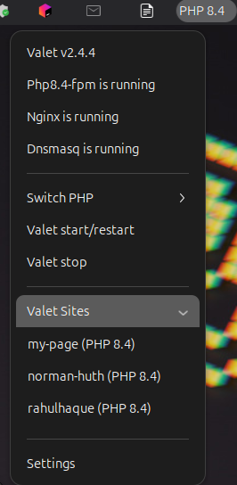

# PHP Laravel Valet

A PHP Laravel Valet status indicator and manager extension (GNOME Panel Applet) for GNOME Shell.

## Supports

|Extension Version|Gnome Shell Version|
|:-:|:-:|
|12|46, 47, 48, 49, 50|
|7|45|
|5|40, 41, 42, 43, 44|

## Prerequisite

- Properly installed and running [Laravel Valet Linux](https://cpriego.github.io/valet-linux/) or [Valet Linux Plus](https://github.com/valet-linux-plus/valet-linux-plus).

## Installation

- Install this extension from [extensions.gnome.org](https://extensions.gnome.org/extension/4985/php-laravel-valet).

## Manual Installation

- Download the zip from the source.

- **GNOME 46**: Create a folder named `php-laravel-valet@rahulhaque` under `~/.local/share/gnome-shell-extensions` folder and extract all the files in this repo.

- **GNOME 50**: Create a folder named `php-laravel-valet@rahulhaque` under `~/.local/share/gnome-shell/extensions` folder and extract all the files in this repo.

- Restart GNOME Shell with **[ALT]** + **[F2]**. Type '**r**' and **[Enter]**

- Or logout and log back in.

## Contributing

- Fork the branch you want to update and create pull request directly for it.
- Name your branch according to the changes or feature it will introduce.
- Default branch will be updated with latest gnome shell release.
- For major gnome shell version upgrade, target dev branch.

## Credits

- [Rahul Haque](https://github.com/rahulhaque)
- [All Contributors](../../contributors)

## License

Licensed under [GNU - General Public License v3](https://www.gnu.org/licenses/gpl-3.0.en.html). Please see the [License File](LICENSE.md) for more information.
