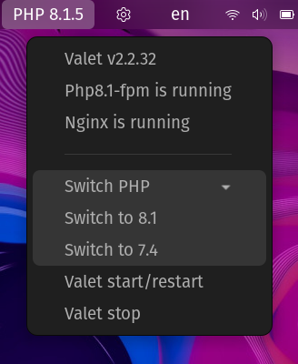

# PHP Laravel Valet

A PHP Laravel Valet status indicator and manager extension (GNOME Panel Applet) for GNOME Shell.

## Supports

|Extension Version|Gnome Shell Version|
|:-:|:-:|
|6|45|
|5|44, 43, 42, 41, 40|

## Prerequisite

- Properly installed and running [Laravel Valet Linux](https://cpriego.github.io/valet-linux/).

## Installation

- Install this extension from [extensions.gnome.org](https://extensions.gnome.org/extension/4985/php-laravel-valet).

### Or

- Download the zip from the source. 
- Create a folder named `php-laravel-valet@rahulhaque` under `~/.local/share/gnome-shell-extensions` folder and extract all the files in this repo.
- Restart GNOME Shell with **[ALT]** + **[F2]**. Type '**r**' and **[Enter]**
- Or logout and log back in.

## Credits

- [Rahul Haque](https://github.com/rahulhaque)
- [All Contributors](../../contributors)

## License

Licensed under [GNU - General Public License v3](https://www.gnu.org/licenses/gpl-3.0.en.html). Please see the [License File](LICENSE.md) for more information.
